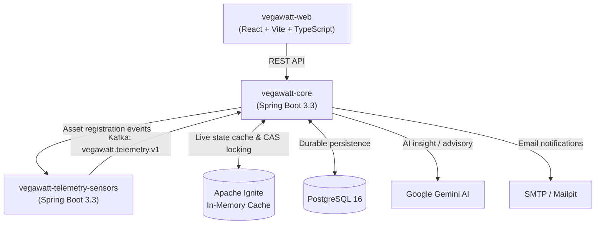
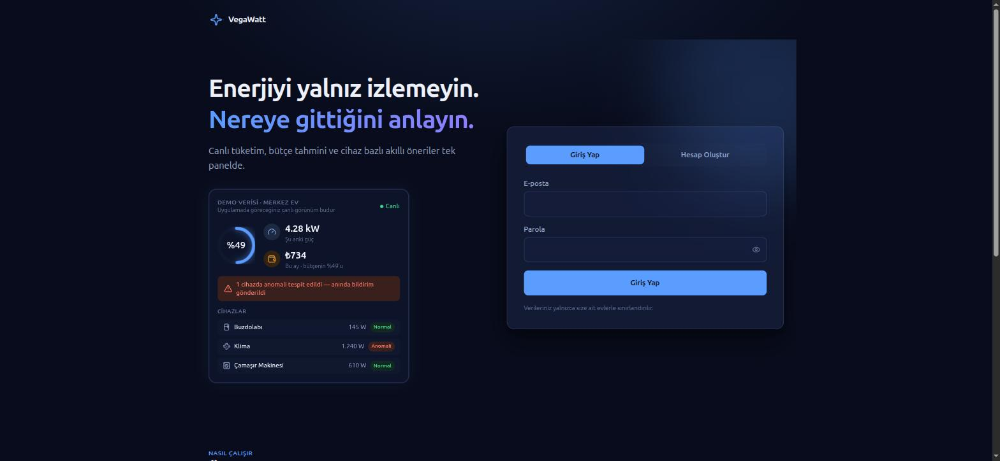
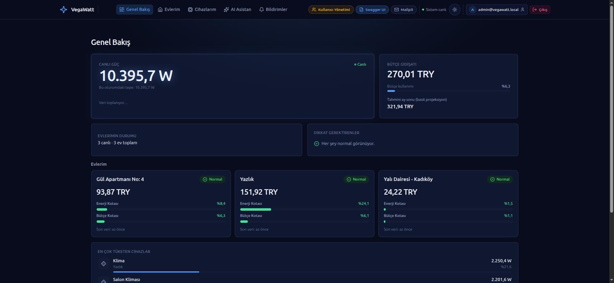
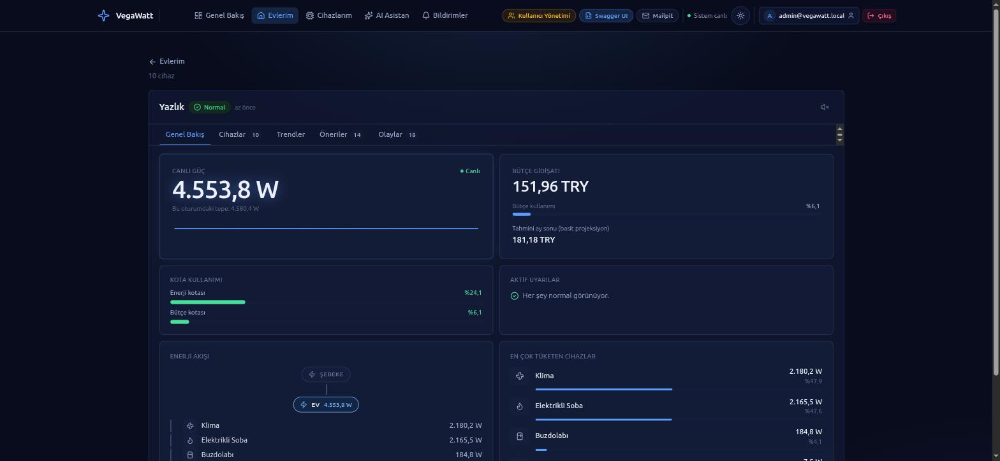
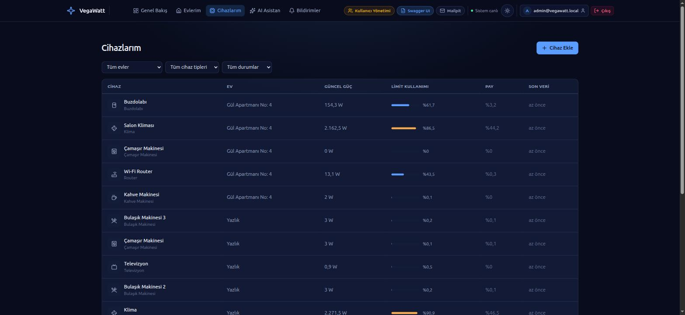
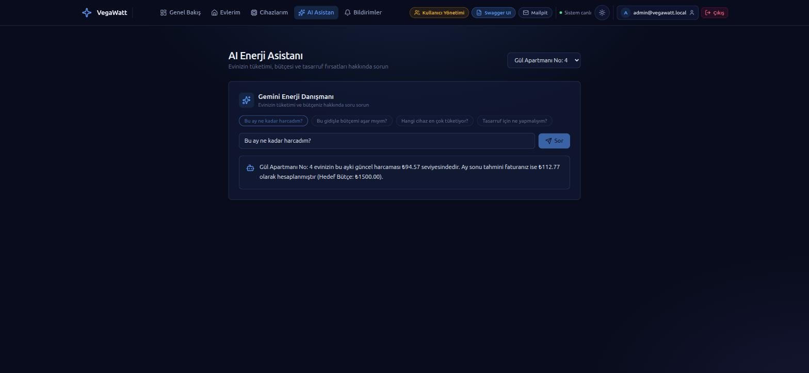
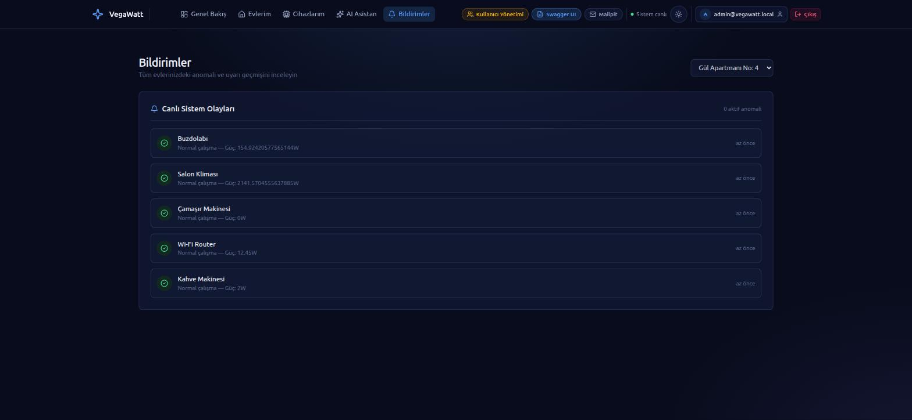
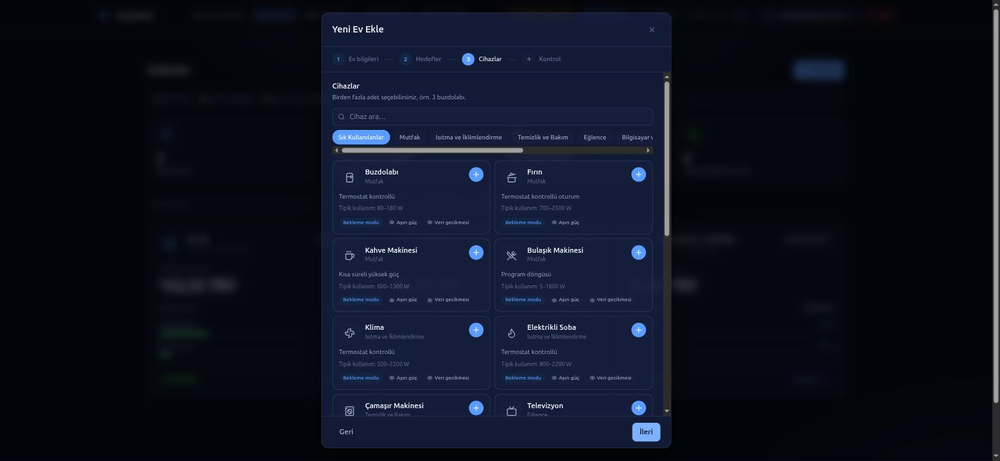
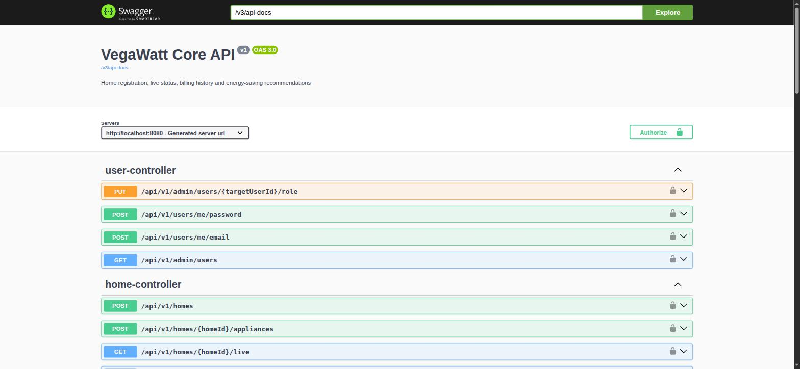

<div align="center">

# ⚡ VegaWatt

### Smart Home Energy Management & Real-Time Telemetry Platform

An end-to-end, event-driven platform that monitors smart-home appliances in real time,
detects anomalies before they become problems, and answers energy questions in plain
language through a Gemini-powered assistant.

[](https://openjdk.org/projects/jdk/17/)
[](https://spring.io/projects/spring-boot)
[](https://react.dev/)
[](https://www.typescriptlang.org/)
[](https://www.postgresql.org/)
[](https://kafka.apache.org/)
[](https://ignite.apache.org/)
[](https://docs.docker.com/compose/)
[](LICENSE)

[Quick Start](#-quick-start) •
[Screenshots](#-screenshots) •
[Architecture](#-architecture) •
[Features](#-key-features) •
[Testing](#-testing) •
[API Docs](#-api-documentation)

</div>

---

## 📖 Overview

VegaWatt lets a household register its home and appliances, then streams simulated
(but behaviourally realistic) telemetry for each device every few seconds. The
platform continuously evaluates that stream against safe-power limits, standby
thresholds, and data-freshness rules — flagging anomalies, sending email alerts, and
keeping a live, millisecond-accurate picture of power draw, accumulated energy, and
projected monthly cost. An AI assistant, backed by Google Gemini, sits on top of all
of this so a user can just ask "will I go over budget this month?" and get a direct
answer grounded in their own data.

The system is built as three independently deployable services (core API, telemetry
simulator, web dashboard) communicating over Kafka, backed by PostgreSQL for durable
history and Apache Ignite for sub-millisecond live-state reads — the same kind of
architecture a real IoT energy-monitoring product would use in production.

---

## 🏗️ Architecture



| Service | Responsibility | Stack |
|---|---|---|
| **`vegawatt-core`** | REST API, JWT auth, home/device management, anomaly & standby evaluation engine, transactional outbox relay, notification worker, Gemini AI integration | Java 17 · Spring Boot 3.3 · Spring Data JPA · Flyway |
| **`vegawatt-telemetry-sensors`** | Deterministic simulator generating realistic per-device telemetry for 45 catalog appliances across 14 distinct behavior profiles | Java 17 · Spring Boot 3.3 · Spring Kafka |
| **`vegawatt-web`** | Responsive dashboard: live power streams, consumption breakdowns, per-device drill-downs, notification center, AI Q&A panel | React 18 · TypeScript · Vite · Tailwind CSS |
| **PostgreSQL 16** | System of record — homes, appliances, catalog, users, billing history, operational events, outbox | — |
| **Apache Kafka** | Low-latency event bus for telemetry ingestion and device/asset registration | — |
| **Apache Ignite** | Distributed in-memory cache tracking live power, cumulative kWh, and health status with millisecond precision and CAS-based concurrency control | — |

---

## 📸 Screenshots

<table>
<tr>
<td width="50%">

**Landing page**


</td>
<td width="50%">

**Live dashboard overview**


</td>
</tr>
<tr>
<td width="50%">

**Per-home detail — live power, budget & energy flow**


</td>
<td width="50%">

**All devices, across every home, at a glance**


</td>
</tr>
<tr>
<td width="50%">

**Gemini-powered energy assistant**


</td>
<td width="50%">

**Live anomaly & system event feed**


</td>
</tr>
<tr>
<td width="50%">

**Guided home registration — 45-device catalog**


</td>
<td width="50%">

**Interactive API documentation (Swagger / OpenAPI 3)**


</td>
</tr>
</table>

---

## ⚡ Key Features

### 🔌 Realistic Device Simulation
A catalog of **45 appliances** spans kitchen, HVAC, laundry, lighting, electronics, and
more, each driven by one of **14 dedicated behavior profiles** — thermostatic cycling,
program cycles (washer/dishwasher), short high-power bursts (kettle), charging curves,
manual switches, always-on variable loads, and more. Only one legacy profile falls back
to a generic default model; every other device has a purpose-built, physically
plausible power curve.

### 🛡️ Smart Anomaly & Safety Monitoring
Every telemetry reading is checked against its device's safe power limit and standby
ceiling in real time. Detection uses **symmetrical hysteresis** (3 consecutive breaches
to flag, 3 consecutive normal readings to clear) plus a minimum notification cooldown —
so a single noisy reading never triggers a false alarm, and a genuinely anomalous
device never gets forgotten mid-recovery.

### 🧠 AI Insight & Energy Assistant
A Gemini-backed advisor answers natural-language questions — *"How much have I spent
this month?"*, *"Will I go over budget?"*, *"Which device uses the most power?"* —
grounded directly in that home's live consumption, budget, and billing data, with a
fallback chain across multiple Gemini models for resilience.

### 📊 Live, Millisecond-Accurate State
Device and home state (current power, accumulated energy, health status) is held in
**Apache Ignite** and updated on every telemetry tick, with **compare-and-swap
versioning** so a scheduled health sweep and a telemetry-driven update can never
silently clobber each other's writes — even under concurrent access.

### 🔐 Defense-in-Depth Security
- JWT access tokens with rotating, single-use refresh tokens (atomic revoke-on-use)
- Home-scoped authorization with IDOR protection (unauthorized access returns `404`, not `403`, so a home's existence is never leaked)
- Per-IP + per-account rate limiting on auth endpoints, keyed correctly even behind a reverse proxy
- No predictable default secrets outside local development — production requires an explicit signing key
- Concurrency-safe invariants (e.g. the system can never be left with zero administrators, even under a race)

### 📨 Reliable Event Delivery
A transactional **outbox pattern** guarantees at-least-once delivery of domain events
to Kafka even across process restarts, with dead-letter handling for anything that
can never succeed (unknown event types, permanently invalid payloads) so a single bad
message can't stall the whole relay.

---

## 🚀 Quick Start

### Prerequisites
- Docker Engine 24+ and Docker Compose v2+
- Git

### 1. Clone the repository
```bash
git clone https://github.com/aytugotmar/VegaWatt.git
cd VegaWatt
```

### 2. Configure environment variables
Docker Compose only auto-loads a file named exactly `.env` (not `.env.example`), and
most variables it references — DB credentials, Kafka/Ignite settings, JWT signing key,
etc. — are required for the stack to start correctly:
```bash
cp .env.example .env
```
The defaults in `.env.example` are enough to run the full stack locally. Set
`GEMINI_API_KEY` in `.env` if you want the AI Insight/advisory features to call the
real Gemini API.

### 3. Run the stack
```bash
docker compose up -d --build
```
Every service builds from source inside its own multi-stage Dockerfile — no local JDK,
Maven, or Node installation is required on the host.

> ⚠️ **To reset all local data** (deletes everything — users, homes, devices, and
> billing history — do not use this as a routine restart):
> ```bash
> docker compose down -v
> docker compose up -d --build
> ```

### 4. Default credentials & endpoints
When launched with `SPRING_PROFILES_ACTIVE=dev` (the default), the system comes
preloaded with sample homes and devices:

| | |
|---|---|
| **Email** | `admin@vegawatt.com` |
| **Password** | `VegaWatt111!` |
| **Dashboard** | [http://localhost:5173](http://localhost:5173) |
| **Backend API** | [http://localhost:8080](http://localhost:8080) |
| **Swagger / API docs** | [http://localhost:8080/swagger-ui.html](http://localhost:8080/swagger-ui.html) |
| **Mailpit** (dev SMTP inbox) | [http://localhost:8025](http://localhost:8025) |

---

## 🧪 Testing

The project is tested at every layer: fast mocked unit tests for business logic, and
real-infrastructure integration tests (Testcontainers-backed PostgreSQL and Kafka) for
anything whose correctness depends on actual database or broker semantics —
transaction isolation, row locking, concurrent access, and message delivery guarantees.

### Backend (`vegawatt-core` and `vegawatt-telemetry-sensors`)
```bash
cd vegawatt-core
./mvnw clean verify          # unit tests + Testcontainers integration tests

cd ../vegawatt-telemetry-sensors
./mvnw clean verify
```

### Frontend (`vegawatt-web`)
```bash
cd vegawatt-web
npm run test                 # Vitest + React Testing Library
npm run build                # production build + type-check
```

---

## 📚 API Documentation

The core service exposes a full OpenAPI 3 specification, browsable via Swagger UI once
the stack is running:

➡️ **[http://localhost:8080/swagger-ui.html](http://localhost:8080/swagger-ui.html)**

---

## 📂 Project Structure

```
VegaWatt/
├── vegawatt-core/                 # Spring Boot backend — REST API, domain logic, persistence
├── vegawatt-telemetry-sensors/    # Telemetry simulator — Kafka producer, device behavior models
├── vegawatt-web/                  # React + TypeScript dashboard
├── docs/screenshots/              # README screenshots
├── docker-compose.yml             # Full local stack definition
└── .env.example                   # Documented environment variable template
```

---

## 📄 License & Contributing

This project is licensed under the [MIT License](LICENSE). Issues and Pull Requests
are welcome.

---

<div align="center">

## 👥 Built by

[**Aytuğ Otmar**](https://github.com/aytugotmar) ·
[**Bekircan Küçükakın**](https://github.com/bekcanckn) ·
[**Kenan Özçakır**](https://github.com/KenanOzcakir)

</div>
