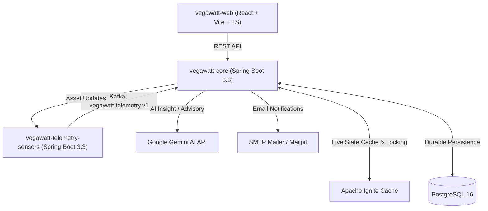

# VegaWatt — Smart Home Energy Management & Telemetry Platform

VegaWatt is an end-to-end modular platform designed to monitor energy consumption of smart home electrical appliances in real time with millisecond telemetry data, detect anomalies and failures, and provide intelligent recommendations and Q&A support backed by Gemini AI.

---

## 🏗️ Architecture

VegaWatt features a microservice-oriented, Event-Driven, high-performance architecture.



### Core Services & Technologies

- **`vegawatt-core`**: Main backend REST API, auth (JWT), home/device management, anomaly/standby/telemetry-health evaluation engine, outbox relay, notification processing, and Gemini AI integration. (Java 17, Spring Boot 3.3, Flyway, JPA).
- **`vegawatt-telemetry-sensors`**: Deterministic simulator and telemetry generator supporting 45 catalog devices and 14 behavior profiles (Thermostatic Cycle, Program Cycle, Short High Power, Manual Switch, etc.) — 13 profiles have dedicated native models, while the single unused profile (`FLOW_TRIGGERED`) falls back to a safe general default behavior.
- **`vegawatt-web`**: Modern, responsive dashboard UI featuring live power streams, consumption breakdowns, detailed device charts, notification center, and AI Insight Q&A panel. (React 18, TypeScript, Tailwind CSS, Lucide icons).
- **PostgreSQL 16**: Transactional database (Homes, Devices, Catalog, Users, Events, Notification Jobs).
- **Apache Kafka**: Low-latency event bus for stream delivery of telemetry data and device registration events.
- **Apache Ignite**: Distributed in-memory state management (Cache) for real-time tracking of device power, cumulative kWh, and anomaly status with millisecond precision.

---

## ⚡ Key Features

1. **Rich Catalog of 45 Devices & Behavior Profiles:** Specialized native behavior models for 13 device categories ranging from major household appliances to small electronics, HVAC, and lighting (only one unused profile out of 14 falls back to a default model).
2. **Smart Anomaly & Safety Limit Monitoring:** Instant detection of power spikes/overcurrent, standby power violations, and telemetry dropouts (Stale / Offline).
3. **Flapping & Email Spam Protection:** Symmetrical recovery thresholds (3 violation / 3 normal readings) combined with minimum notification cooldown periods to prevent redundant alerts.
4. **AI Insight & Energy Assistant (`Gemini AI`):** Analyzes budget and consumption data to provide human-like real-time answers to questions such as "How much did I spend this month?" or "Will I exceed my budget?".
5. **Advanced Security:** Home-scoped IDOR protection (404 masking), JWT refresh cookies, and IP + Email rate limiting.

---

## 🚀 Quick Start & Docker Setup

### Prerequisites
- Docker Engine 24+ and Docker Compose v2+
- Git

### 1. Clone the repository
```bash
git clone https://github.com/aytugotmar/VegaWatt.git
cd VegaWatt
```

### 2. Run the Stack
```bash
docker compose up -d --build
```

> ⚠️ **If you want to reset all local data** (deletes everything including users, homes, devices, and billing history — do not use as a routine startup command):
> ```bash
> docker compose down -v
> docker compose up -d --build
> ```

### 3. Default Credentials & Endpoints
When launched with `SPRING_PROFILES_ACTIVE=dev` (default), the system comes preloaded with sample homes and devices:
- **Email:** `admin@vegawatt.com`
- **Password:** `VegaWatt111!`
- **Dashboard:** [http://localhost:5173](http://localhost:5173)
- **Backend API:** [http://localhost:8080](http://localhost:8080)
- **Swagger Documentation:** [http://localhost:8080/swagger-ui.html](http://localhost:8080/swagger-ui.html)

---

## 🧪 Testing Commands

### Backend Tests (Integration & Unit)
```bash
# Core Service Tests
cd vegawatt-core
./mvnw clean verify

# Sensors Service Tests
cd ../vegawatt-telemetry-sensors
./mvnw clean verify
```

### Frontend Tests & Build
```bash
cd vegawatt-web
npm run test
npm run build
```

---

## 📄 License & Contributing
This project is licensed under the MIT License. Feel free to open a Pull Request to contribute.

---

## By

- [Aytuğ Otmar](https://github.com/aytugotmar)
- [Bekircan Küçükakın](https://github.com/bekcanckn)
- [Kenan Özçakır](https://github.com/KenanOzcakir)