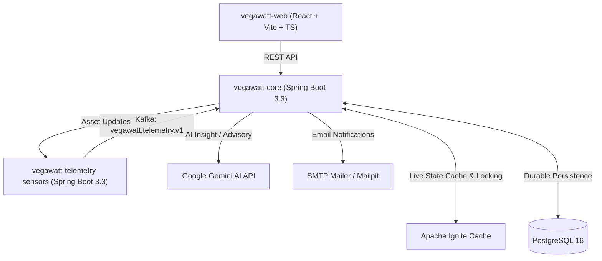

# VegaWatt — Akıllı Ev Enerji Yönetimi ve Telemetri Platformu

VegaWatt, akıllı evlerdeki elektrikli cihazların enerji tüketimlerini milisaniyelik telemetri verileriyle anlık izleyen, anomali ve arızaları tespit eden, Gemini AI altyapısıyla akıllı öneriler ve soru-cevap desteği sunan uçtan uca modüler bir platformdur.

---

## 🏗️ Mimari Yapı

VegaWatt mikroservis odaklı, olay güdümlü (Event-Driven) ve yüksek performanslı bir mimariye sahiptir.



### Temel Servisler ve Teknolojiler

- **`vegawatt-core`**: Ana backend REST API, auth (JWT), ev/cihaz yönetimi, anomali/standby/telemetry-health değerlendirme motoru, outbox relay, bildirim işleme ve Gemini AI entegrasyonu. (Java 17, Spring Boot 3.3, Flyway, JPA).
- **`vegawatt-telemetry-sensors`**: 45 farklı katalog cihazı ve 14 davranış profili (Thermostatic Cycle, Program Cycle, Short High Power, Manual Switch vb.) için deterministik simülatör ve telemetri jeneratörü — 13 profilin kendine özgü native modeli var, kullanılmayan tek profil (`FLOW_TRIGGERED`) güvenli bir genel varsayılan davranışa düşer.
- **`vegawatt-web`**: Modern, responsive dashboard UI. Canlı güç akışları, tüketim detayları, cihaz detay grafikleri, bildirim merkezi ve AI Insight soru-cevap paneli. (React 18, TypeScript, Tailwind CSS, Lucide icons).
- **PostgreSQL 16**: İşlemsel veritabanı (Evler, Cihazlar, Katalog, Kullanıcılar, Olaylar, Bildirim Job'ları).
- **Apache Kafka**: Telemetri ve cihaz kayıt olaylarının iletildiği düşük gecikmeli event-bus.
- **Apache Ignite**: Cihazların canlı güç, birikimli kWh ve anomali durumlarının milisaniyelik bellek içi state yönetimi (Distributed Cache).

---

## ⚡ Temel Özellikler

1. **45 Cihazlık Zengin Katalog & Davranış Profilleri:** Beyaz eşyalardan küçük ev aletlerine, ısıtma/soğutma sistemlerinden aydınlatmaya kadar tüm cihaz tipleri için özelleştirilmiş 13 native davranış modeli (14 profilden yalnızca kullanılmayan biri genel bir varsayılana düşer).
2. **Akıllı Anomali ve Güvenli Limit Takibi:** Aşırı güç çekimi, standby tüketim ihlali ve telemetri kesintilerini (Stale / Offline) anlık tespit eder.
3. **Flapping & Mail Spam Koruması:** Simetrik recovery eşikleri (3 ihlal / 3 normal okuma) ve minimum bildirim cooldown süreleri ile gereksiz bildirimleri engeller.
4. **AI Insight & Enerji Asistanı (`Gemini AI`):** Bütçe ve tüketim verilerini analiz eder, "Bu ay ne kadar harcadım?", "Bütçemi aşar mıyım?" gibi sorulara insan diliyle anlık yanıt verir.
5. **Gelişmiş Güvenlik:** Home-scoped IDOR koruması (404 maskeleme), JWT refresh cookie, IP+Email bazlı Rate Limiting.

---

## 🚀 Hızlı Başlangıç & Docker Kurulumu

### Ön Gereksinimler
- Docker Engine 24+ ve Docker Compose v2+
- Git

### 1. Depoyu klonlayın
```bash
git clone https://github.com/aytugotmar/VegaWatt.git
cd VegaWatt
```

### 2. Stack'i Çalıştırın
```bash
docker compose up -d --build
```

> ⚠️ **Tüm local verileri sıfırlamak isterseniz** (kullanıcılar, evler, cihazlar, billing geçmişi
> dahil her şeyi siler — rutin başlatma komutu olarak kullanmayın):
> ```bash
> docker compose down -v
> docker compose up -d --build
> ```

### 3. Kullanıcı Bilgileri (Default Admin)
`SPRING_PROFILES_ACTIVE=dev` (varsayılan) ile sistem başlatıldığında örnek evler ve cihazlarla hazır gelir:
- **E-posta:** `admin@vegawatt.com`
- **Şifre:** `VegaWatt111!`
- **Panel Adresi:** [http://localhost:5173](http://localhost:5173)
- **Backend API:** [http://localhost:8080](http://localhost:8080)
- **Swagger Documentation:** [http://localhost:8080/swagger-ui.html](http://localhost:8080/swagger-ui.html)

---

## 🧪 Test Komutları

### Backend Testleri (Integration & Unit)
```bash
# Core Servisi Testleri
cd vegawatt-core
./mvnw clean verify

# Sensors Servisi Testleri
cd ../vegawatt-telemetry-sensors
./mvnw clean verify
```

### Frontend Testleri & Build
```bash
cd vegawatt-web
npm run test
npm run build
```

---

## 📄 Lisans & Katkı
Bu proje MIT lisansı altında lisanslanmıştır. Katkıda bulunmak için lütfen bir Pull Request açın.
